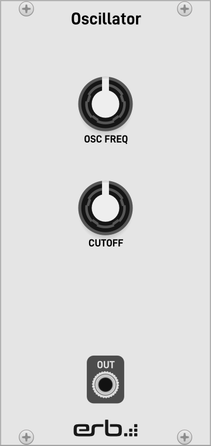

# erb-daisysp

⚠️ **This repository is a Work In Progress** ⚠️

[](https://opensource.org/licenses/MIT)

The `erb-daisysp` project shows how to use [`eurorack-blocks`](https://github.com/ohmtech-rdi/eurorack-blocks) with [`DaisySP`](https://github.com/electro-smith/DaisySP) to develop your own custom Eurorack module. It also provides a thin wrapper around `DaisySP` classes to ease integration with idiomatic `eurorack-blocks` source code.

As with `eurorack-blocks`, testing and debugging can be done in a [virtual Eurorack environment](https://vcvrack.com), and when ready, it can auto-magically generate all the needed files to manufacture the Eurorack module for you to use in a real Eurorack modular system.

This repository is part of the [`eurorack-blocks` documentation](https://eurorack-blocks.readthedocs.io/en/latest/).

```cpp
// SimpleOscillator.h

#include "artifacts/SimpleOscillatorUi.h"

#include "erb/erb.h"
#include "erb/daisysp.h"

using namespace erb::literals;

struct SimpleOscillator
{
   SimpleOscillatorUi ui;

   erb::Oscillator oscillator;
   erb::Tone tone;

   void  init () {
      oscillator.amplitude = -3_dB;
      oscillator.waveform = erb::Oscillator::Waveform::PolyBlepSquare;
   }

   void  process () {
      oscillator.frequency = erb::scale (ui.frequency, 80_Hz, 10_kHz, 0.25f /* skew */);
      tone.cutoff = erb::scale (ui.cutoff, 30_Hz, 20_kHz, 0.25f /* skew */);

      ui.audio_out = tone (oscillator ());
   }
};
```



```erbui
// SimpleOscillator.erbui

module SimpleOscillator {
   width 12hp
   board kivu12
   material aluminum

   header { label "Oscillator" }

   control frequency Pot {
      position 6hp, 30mm
      label "OSC FREQ"
   }

   control cutoff Pot {
      position 6hp, 60mm
      label "CUTOFF"
   }

   control audio_out AudioOut {
      position 6hp, 111mm
      label "OUT"
   }
}
```

Alternatively, you can also use the original `DaisySP` classes directly.

```cpp
// SimpleOscillator.h

#include "artifacts/SimpleOscillatorUi.h"

#include "erb/erb.h"
#include "erb/daisysp.h"

struct SimpleOscillator
{
   SimpleOscillatorUi ui;

   daisysp::Oscillator oscillator;
   daisysp::Tone tone;

   void  init () {
      oscillator.Init (erb_SAMPLE_RATE);
      oscillator.SetAmp (0.71f /* -3 dB */);
      oscillator.SetWaveform (daisysp::Oscillator::WAVE_POLYBLEP_SQUARE);

      tone.Init (erb_SAMPLE_RATE);
   }

   void  process () {
      oscillator.SetFreq (erb::scale (ui.frequency, 80.f /* Hz */, 10000.f /* Hz */, 0.25f /* skew */));
      tone.SetFreq (erb::scale (ui.cutoff, 30.f /* Hz */, 20000.f /* Hz */, 0.25f /* skew */));

      for (size_t i = 0 ; i < erb_BUFFER_SIZE ; ++i)
      {
         auto x = oscillator.Process ();
         ui.audio_out [i] = tone.Process (x);
      }
   }
};
```

> **Warning**
> Be aware though, that while looking equivalent, the code above is doing sample-to-sample
> processing, while the eurorack-block wrapper will favor block processing.
> Doing sample-to-sample processing when not really needed (_eg_ outside of a feedback loop)
> can have a severe performance impact on the small Daisy MCU cache, which
> block processing avoids by design.


## Sample Projects

- [`simple-oscillator-no-wrapper`](./samples/simple-oscillator-no-wrapper/)
   is an example without using the Eurorack-blocks wrapper,
- [`simple-oscillator`](./samples/simple-oscillator/)
   is an example using the Eurorack-blocks wrapper.


## Setting up

Setting up the development environment is described in the
[documentation](https://eurorack-blocks.readthedocs.io/en/latest/getting-started/setup.html).


## Manifest

The thin wrapper provides:
- A way to maximise syntactic compatibility and cohesion with Eurorack-blocks,
- Strong typing and specialized literals to ease reading,
- Block processing, to avoid the cache performance penalty when doing sample-to-sample processing when not really needed (_eg_ outside of a feedback loop).


## License

All files in this repository, excluding `submodules/`, are provided with the MIT license.
